# LOCAL CONNECT — APP / WEB FLOW

**Product:** Local Connect  
**Official Tagline:** **Need → Match → Connect**  
**Document Type:** Application / Web User Flow  
**Source of Truth:** PRD + TRD  
**Scope:** Hackathon MVP

---

# 1. Purpose

This document defines **what users do and how Local Connect responds**.

It deliberately does **not** define:

- Visual UI design
- Component specifications
- Database schema
- Implementation code
- Detailed API contracts

The product flow is centered on:

> **NEED → UNDERSTAND → MATCH → TRUST → CONNECT**

The PRD establishes the core experience as natural-language need input, AI understanding, candidate retrieval, ranking, match explanation, trust/community signals, and connection. The TRD reinforces the technical sequence of structured requirements → candidate retrieval → deterministic matching → trust/location/availability signals → ranked providers → request/contact. 

---

# A. MASTER USER JOURNEY

## A.1 Primary Customer Journey

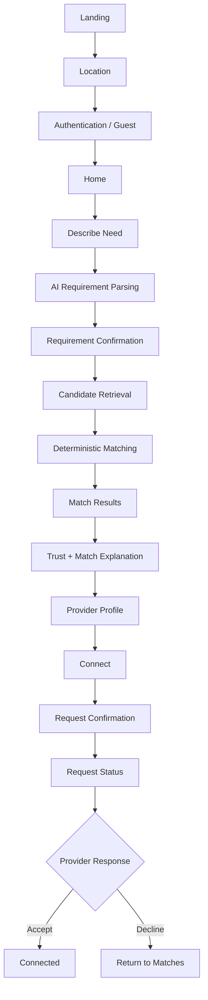

## A.2 Product Loop

```text
NEED
 ↓
User describes requirement
 ↓
UNDERSTAND
 ↓
AI extracts structured requirements
 ↓
User confirms / edits
 ↓
MATCH
 ↓
Providers retrieved + ranked
 ↓
TRUST
 ↓
User evaluates match reasons + trust evidence
 ↓
CONNECT
 ↓
Service request
 ↓
Provider response
```

The PRD explicitly positions the product around this loop and states that everything else should support the core **Need → Match → Connect** experience. fileciteturn4file5L1159-L1200

---

# B. NAVIGATION ARCHITECTURE

## B.1 Customer Navigation

```text
Home
├── Describe a Need
│   ├── AI Parsing
│   ├── Requirement Confirmation
│   └── Match Results
│       ├── Provider Profile
│       ├── Trust Details
│       └── Connect
│
├── Discover
│   ├── Search
│   ├── Categories
│   ├── Filters
│   └── Map
│
├── Post a Need
│   ├── Requirement
│   ├── Budget
│   ├── Location
│   ├── Date / Time
│   ├── Review
│   └── Published Need
│
├── Requests
│   ├── Active
│   ├── Pending
│   ├── Accepted
│   ├── Declined
│   └── Completed
│
└── Profile
    ├── Customer Details
    ├── Saved Providers
    ├── Recommendations
    └── Settings
```

## B.2 Provider Navigation

```text
Provider Dashboard
├── Profile
├── Incoming Requests
│   └── Request Detail
│       ├── Accept
│       └── Decline
├── Availability
├── Services / Skills
├── Pricing
├── Service Area
├── Trust
└── Profile Editing
```

## B.3 Route-Level Architecture

The TRD defines minimum routes around authentication, search, matches, provider profiles, requests, customer profile, and provider profile/requests. fileciteturn3file1L277-L294

Recommended product-level route map:

```text
/
├── /auth
├── /onboarding
├── /home
├── /search
├── /matches
├── /providers/:id
├── /providers/:id/trust
├── /post-need
├── /requests
├── /requests/:id
├── /saved
├── /profile
│
└── /provider
    ├── /provider/onboarding
    ├── /provider/dashboard
    ├── /provider/profile
    ├── /provider/profile/edit
    ├── /provider/requests
    └── /provider/requests/:id
```

---

# C. ENTRY FLOW

## C.1 Landing

### Purpose

Introduce Local Connect and immediately communicate the core action.

### Entry Point

User opens the PWA.

### User Actions

- Explore the product
- Start describing a need
- Sign in
- Create account
- Continue as guest where supported

### Product Response

Show the primary value proposition:

> **Find the right trusted person nearby.**

Primary action:

**Tell us what you need**

### Next States

- Need Input
- Authentication
- Guest Home

### Exit Points

- Close app
- Continue into product

---

# C.2 Location Permission

### Purpose

Enable hyperlocal discovery.

### Entry Point

First discovery interaction or onboarding.

### User Actions

- Allow location
- Deny location
- Choose location manually

### Product Response

If allowed:

```text
Location acquired
→ determine approximate locality
→ use location for discovery
```

If denied:

```text
Location denied
→ Manual locality/address selection
→ Geocode
→ Continue
```

Location is optional; the TRD explicitly requires the product to remain usable when browser location permission is denied. fileciteturn4file2L557-L563

### Exit Points

- Home
- Search
- Need Input

---

# C.3 Authentication

### Purpose

Establish identity when required.

### Entry Point

- Sign in
- Create account
- Protected action such as Connect

### User Actions

- Sign up
- Log in
- Reset password
- Continue as guest if available

### Product Response

Successful authentication returns the user to the action they were attempting.

Example:

```text
Guest views provider
 ↓
Guest taps Connect
 ↓
Authentication
 ↓
Return to provider
 ↓
Continue Connect flow
```

### Exit Points

- Home
- Previous intended screen
- Authentication error

Authentication is required for service requests, profile editing, reviews, and recommendations according to the TRD. fileciteturn4file4L1031-L1071

---

# C.4 Onboarding

## Customer Onboarding

Collect only the minimum information needed.

### Flow

```text
Account
 ↓
Name
 ↓
Basic profile
 ↓
Location
 ↓
Customer Home
```

### Exit Points

- Home
- Location fallback

## Provider Onboarding

Provider onboarding is covered in Section D.

---

# D. CUSTOMER FLOW

## D.1 Core Flow

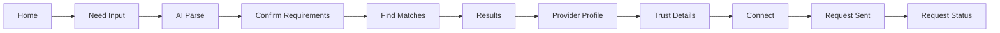

---

# D.2 Home

### Purpose

Provide one obvious starting point.

### Entry Point

- Successful onboarding
- Bottom navigation Home
- App launch

### User Actions

- Describe a need
- Search manually
- Browse categories
- Post a Need
- View active requests
- Open profile

### Product Response

The primary experience should be:

> **What do you need?**

### Next States

- AI Need Input
- Search
- Category Results
- Post a Need
- Requests

### Exit Points

All main customer flows.

---

# D.3 Describe a Need

### Purpose

Capture the requirement naturally.

### User Action

Enter free-form text.

Example:

> “Mujhe 10th ke liye female maths teacher chahiye, weekend pe, 4 km ke andar, ₹500 tak.”

The PRD explicitly supports natural-language English/Hinglish input and editable extracted requirements. fileciteturn4file5L1159-L1199

### Product Response

Submit the raw requirement to AI parsing.

### Next State

AI Parsing.

### Exit Points

- Cancel → Home
- Submit → AI Parsing

---

# D.4 AI Requirement Parsing

### Purpose

Convert natural language into structured requirements.

### Flow

```text
Raw Need
 ↓
AI Parser
 ↓
Validated Structured Requirement
 ↓
Requirement Review
```

The TRD requires AI output to be schema-validated and business-validated before matching. fileciteturn4file6L1372-L1402

### Extracted Information

Potential fields:

- Category
- Service
- Skills
- Education level
- Preferences
- Budget
- Availability
- Radius
- Location
- Urgency
- Language

### Product Response

Show an understandable processing state.

Do not expose technical AI/API details.

### Exit Points

- Success → Requirement Confirmation
- Ambiguous → Clarification
- Failure → AI Failure Flow

---

# D.5 Requirement Confirmation

### Purpose

Give the user control over AI interpretation.

### Example

```text
I understood this as:

Mathematics
Class 10
Female
Weekend
₹500
≤4 km
```

### User Actions

- Edit chip
- Remove chip
- Add requirement
- Confirm
- Go back and rewrite

### Product Response

When confirmed:

```text
Requirement locked
→ Matching begins
```

### Important Rule

The AI must not invent missing requirements. Unknown values remain unknown/null rather than being silently fabricated. fileciteturn4file6L1383-L1418

### Exit Points

- Confirm → Matching
- Edit → Requirement Editor
- Back → Need Input

---

# D.6 Matching

### Purpose

Retrieve and rank relevant providers.

### System Flow

```text
Structured Requirement
 ↓
Hard Filters
 ↓
Candidate Providers
 ↓
Feature Normalization
 ↓
Weighted Score
 ↓
Threshold
 ↓
Rank
 ↓
Explain
```

This deterministic matching pipeline is specified in the TRD. fileciteturn4file2L529-L555

### Matching Signals

- Skill relevance
- Distance
- Budget
- Availability
- Trust
- Rating
- Response rate
- Experience

### Product Response

Show a short matching state, then results.

### Exit Points

- Results
- No Strong Matches
- Matching Error

---

# D.7 Match Results

### Purpose

Help the user choose the most suitable provider.

### Result Structure

Each result should communicate:

1. Match quality
2. Provider identity
3. Practical fit
4. Trust
5. Connection action

### Example

```text
94% Match

Priya Sharma
Mathematics Tutor

1.2 km
₹450
Weekend available

Trust 89
Recommended by 12 nearby

Why this matches:
✓ Class 10 Mathematics
✓ Within your budget
✓ 1.2 km away
✓ Available weekends
✓ Strong local trust
```

The PRD requires match explanations based on actual ranking signals rather than opaque AI decisions. fileciteturn4file7L1540-L1567

### User Actions

- View profile
- View trust
- Save provider
- Connect
- Change filters
- Change requirement
- Switch to map

### Exit Points

- Provider Profile
- Trust Details
- Saved
- Request
- Search/Filters
- Map

---

# D.8 Provider Profile

### Purpose

Allow the user to make a confident decision before connecting.

### Information

- Name
- Skills
- Services
- Distance
- Pricing
- Availability
- Experience
- Ratings
- Trust Score
- Verification indicators
- Community recommendations
- Reviews

These are defined as provider-profile information in the PRD. fileciteturn4file5L433-L448

### User Actions

- View trust
- View reviews
- View recommendations
- Save provider
- Connect
- Return to results

### Exit Points

- Trust Details
- Connect
- Back to Results
- Saved

---

# E. PROVIDER FLOW

## E.1 Provider Onboarding

### Purpose

Make a skilled individual discoverable.

### Flow

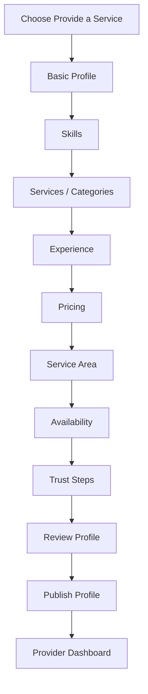

### Required Information

The PRD specifies:

- Name
- Profile photo
- Skills
- Categories
- Experience
- Pricing
- Availability
- Service area
- Description
- Contact preference fileciteturn3file0L416-L430

### Exit Points

- Complete onboarding
- Save progress
- Cancel

---

# E.2 Provider Dashboard

### Purpose

Provide a lightweight operating center.

### Primary Information

- Incoming requests
- Current availability
- Profile status
- Trust indicators
- Services
- Basic request status

### User Actions

- View request
- Accept
- Decline
- Update availability
- Edit profile
- Update pricing
- Update service area

### Rule

Do not turn the MVP into an analytics-heavy provider dashboard. The PRD explicitly excludes complex analytics from MVP scope. fileciteturn3file0L385-L395

---

# E.3 Incoming Request

### Purpose

Help provider decide whether to accept a relevant need.

### Request Displays

- Customer need
- Requirement summary
- Approximate location
- Budget
- Date/time
- Relevant constraints
- Request timestamp

### User Actions

**Accept**

**Decline**

### Exit Points

- Accept → Connected / Active Request
- Decline → Declined State
- Back → Dashboard

---

# E.4 Provider Request Response

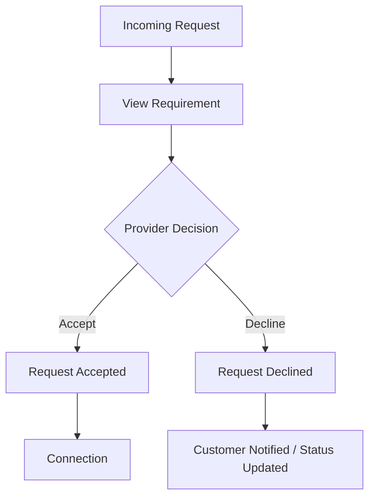

The TRD keeps the request lifecycle intentionally small:

```text
created → sent → accepted → completed
                 ↘ declined
                 ↘ cancelled
```

fileciteturn4file6L1309-L1333

---

# F. AI FLOW

## F.1 Complete AI Flow

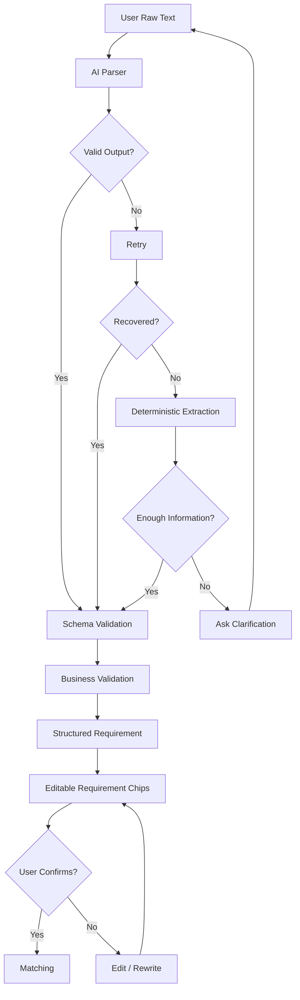

## F.2 AI Failure

The TRD defines this fallback:

```text
AI failure
 ↓
Retry
 ↓
Deterministic extraction where possible
 ↓
Request clarification if required
```

fileciteturn4file8L1737-L1749

### User Experience

Never show:

- Raw API errors
- Stack traces
- Internal implementation details

Instead:

> **We couldn't fully understand that request.**

Then show what was understood, if useful, and ask the user to clarify.

---

# G. SEARCH FLOW

## G.1 Search Architecture

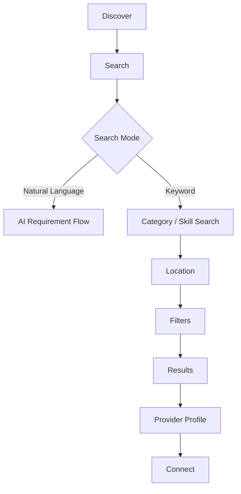

## G.2 Search

### User Actions

- Enter keyword
- Enter natural-language requirement
- Select category
- Choose location
- Apply filters

### Product Response

Return relevant providers.

### Filters

- Category
- Skill
- Distance
- Budget
- Availability
- Trust
- Rating
- Experience

### Exit Points

- Provider Profile
- Map
- New Search
- AI Need Flow

---

# G.3 Categories

Categories are a secondary discovery mechanism, not the primary product identity.

Initial examples include:

- Education
- Home Services
- Food
- Creative
- Technology
- Personal

These categories are defined as MVP examples in the product material. fileciteturn4file7L1476-L1502

### Flow

```text
Category
 ↓
Relevant Skills / Services
 ↓
Location
 ↓
Results
 ↓
Provider Profile
```

---

# G.4 Filters

### User Actions

- Select filter
- Remove filter
- Reset filters
- Apply filters

### Product Response

Refresh results.

### Important Behavior

Unknown provider information must not be fabricated.

For example, unknown availability is not automatically treated as available. The TRD explicitly distinguishes unknown from available in availability scoring. fileciteturn3file1L755-L766

---

# H. POST A NEED FLOW

## H.1 Complete Flow

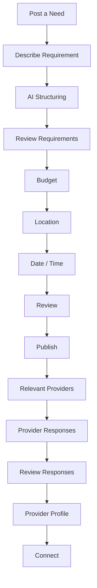

## H.2 Step Details

### 1. Post a Need

**Purpose:** User requests help without manually searching.

### 2. Requirement

User describes what they need.

AI structures it.

### 3. Budget

User enters optional or required budget depending on need.

Invalid budgets are rejected; missing budgets are not invented. fileciteturn4file8L1765-L1775

### 4. Location

User provides:

- Current location
- Locality
- Address/search location

### 5. Date / Time

User specifies when the service is needed.

### 6. Review

Show all structured information before publishing.

### 7. Publish

Create the need/request.

### 8. Provider Responses

Relevant providers can discover/respond.

### 9. Response Review

User compares providers.

### 10. Connect

User selects a provider and continues to the connection/request state.

The PRD explicitly describes Post a Need as a simple request-response experience rather than a complex bidding marketplace. fileciteturn3file0L660-L684

---

# I. MATCHING FLOW

## I.1 Matching Pipeline

```text
User Requirement
 ↓
Hard Constraints
 ↓
Geographic Candidate Retrieval
 ↓
Skill Relevance
 ↓
Distance
 ↓
Budget
 ↓
Availability
 ↓
Trust
 ↓
Rating
 ↓
Experience
 ↓
Match Score
 ↓
Threshold
 ↓
Rank
 ↓
Explain
```

## I.2 Hard Filters

Applicable hard constraints include:

- Provider active
- Relevant category
- Sufficient skill relevance
- Within allowed radius
- Budget where explicitly required
- Required availability

The TRD explicitly defines candidate retrieval before scoring and requires server-side filtering rather than fetching all providers into the browser. fileciteturn4file4L982-L1003

## I.3 Ranking

The TRD's recommended MVP weighting is:

```text
30% Skill Relevance
20% Distance
15% Budget Fit
15% Availability
10% Trust
 5% Rating
 5% Experience
```

This is a technical matching rule, while the UX responsibility is to expose the resulting reasons transparently.

## I.4 Match Threshold

If no provider reaches the configured minimum threshold:

```text
No strong matches found
```

Do not present poor matches as strong matches. fileciteturn4file4L1007-L1023

---

# J. TRUST FLOW

## J.1 Where Trust Appears

Trust should be visible at three levels.

### Level 1 — Results

Compact:

```text
Trust 89
```

### Level 2 — Provider Profile

Show:

- Trust Score
- Verification indicators
- Ratings
- Community recommendations
- Completed jobs where available

### Level 3 — Trust Details

User taps the score to understand the evidence.

---

# J.2 Trust Interaction

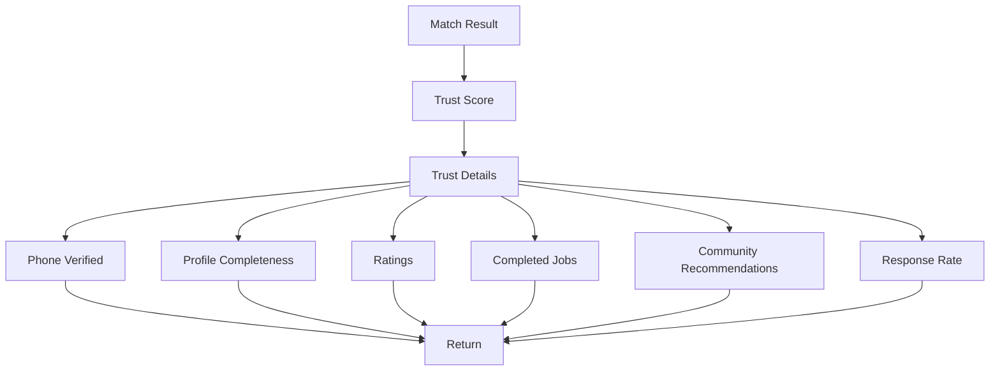

The PRD defines Trust Score as an evidence-based indicator and explicitly says it should not be presented as a guarantee that someone is definitely trustworthy. fileciteturn3file0L601-L622

---

# J.3 Verification States

Use distinct meanings:

- **Phone Verified**
- **Identity Submitted**
- **Community Recommended**
- **Profile Verified**

Do not present any of these as government/KYC verification unless such verification actually exists. fileciteturn4file7L1571-L1597

---

# J.4 Community Recommendation Flow

```text
Eligible Interaction
 ↓
User chooses Recommend Provider
 ↓
Recommendation Submitted
 ↓
Recommendation Count Updated
 ↓
Trust Signals Recalculated
 ↓
Provider Profile Updated
```

Recommendations should ideally be associated with genuine interactions and should not be repeatedly submitted by the same user/provider relationship. The PRD distinguishes recommendations from ordinary reviews: recommendations act as a community trust signal. fileciteturn3file0L628-L654

---

# K. AVAILABILITY FLOW

## K.1 Provider States

The product should expose three practical states:

### Available

Provider can currently accept relevant work.

### Busy

Provider is temporarily unavailable or has limited capacity.

### Offline

Provider is not currently accepting requests.

## K.2 Availability Interaction

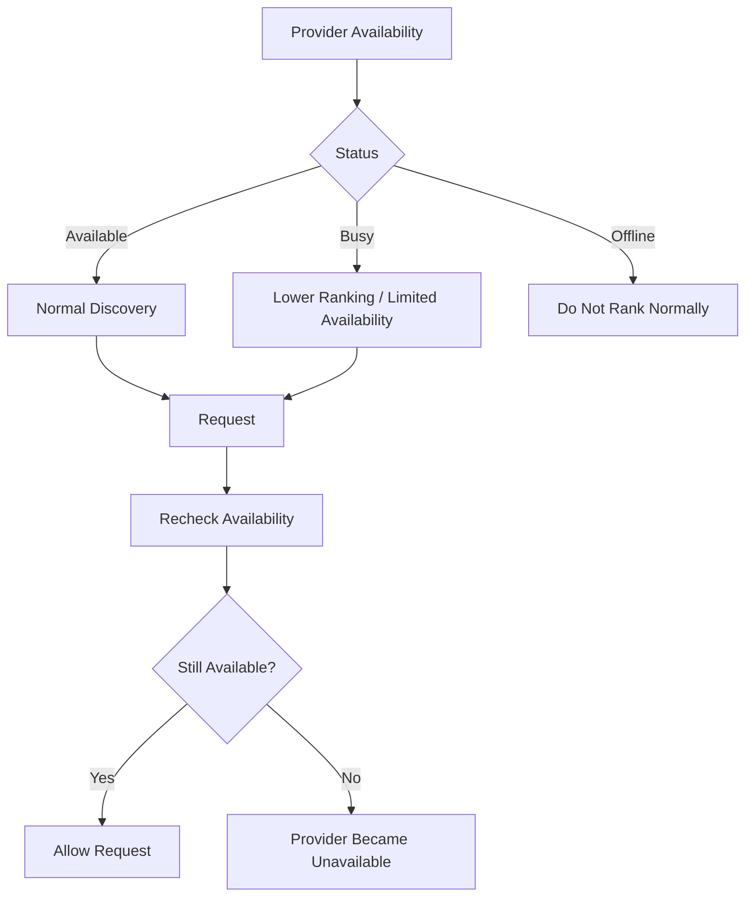

The TRD requires availability to influence matching and says provider availability should be rechecked before the final connection action where applicable. fileciteturn4file8L1751-L1763

## K.3 Unknown Availability

If availability is unknown:

- Do not show “Available”
- Do not fabricate a schedule
- Allow the provider to appear if otherwise relevant
- Explain that availability needs confirmation

---

# L. MAP FLOW

## L.1 Map Architecture

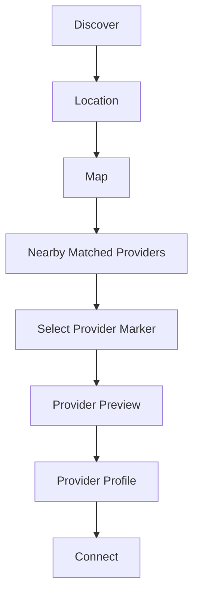

## L.2 Location Permission

If permission is denied:

```text
Map
 ↓
Select Locality / Search Address
 ↓
Geocode
 ↓
Show Approximate Area
```

The TRD explicitly requires manual locality/address fallback and says exact customer coordinates should not be exposed by default. fileciteturn4file8L1751-L1757 fileciteturn4file8L1655-L1661

## L.3 Provider Selection

User taps a relevant provider marker.

Product responds with:

- Provider identity
- Match score
- Distance
- Trust
- Quick action

Then:

**View Profile**

## L.4 Map Role

Map is a discovery enhancement, not the primary matching engine.

The core matching flow must work without map interaction.

---

# M. REQUEST / CONNECT FLOW

## M.1 Direct Connect

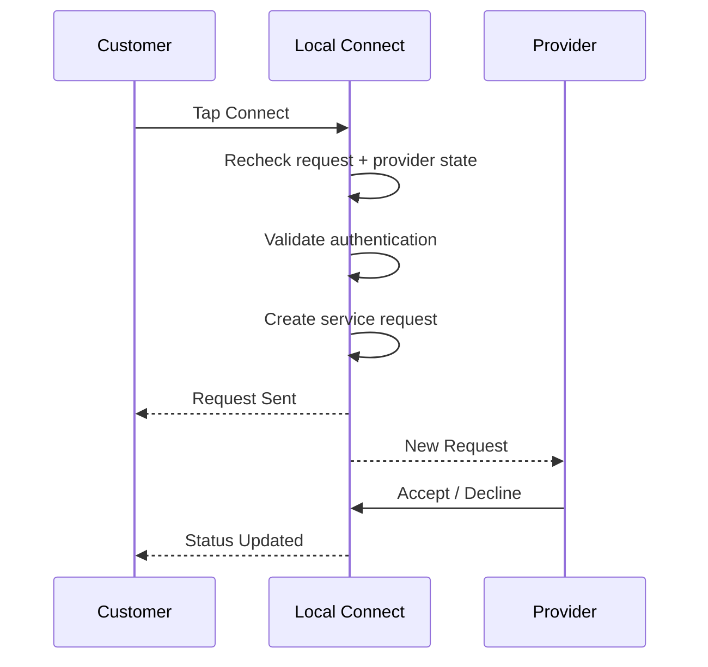

## M.2 Request Creation

### Entry

Customer taps **Connect**.

### Preconditions

- User authenticated
- Provider still active
- Provider availability rechecked where applicable
- Request valid
- User authorized

### Product Response

If valid:

> **Request sent**

Then show request status.

### Exit Points

- View Request
- Return to Matches
- Provider Profile

---

# M.3 Request Lifecycle

```text
CREATED
 ↓
SENT
 ├──→ ACCEPTED
 │      ↓
 │   CONNECTED
 │      ↓
 │   COMPLETED
 │
 ├──→ DECLINED
 │
 └──→ CANCELLED
```

The TRD explicitly recommends this small request lifecycle for MVP. fileciteturn4file6L1320-L1333

---

# M.4 Customer Request Status

Customer should be able to see:

### Sent

Provider has received the request.

### Accepted

Provider accepted.

### Declined

Provider declined.

### Cancelled

Customer cancelled where allowed.

### Completed

Interaction/service is complete.

### Next Actions

Depending on status:

- View provider
- Cancel
- Contact/respond where supported
- Leave review after eligible completion
- Recommend provider after eligible interaction

---

# N. PROFILE FLOWS

# N.1 Customer Profile

## Entry

Profile navigation.

## Information

- Name
- Profile image
- Locality
- Saved providers
- Requests
- Recommendations given
- Settings

## Actions

- Edit profile
- View saved providers
- View requests
- Manage settings

### Exit Points

- Home
- Requests
- Saved
- Provider Profile

---

# N.2 Saved Providers

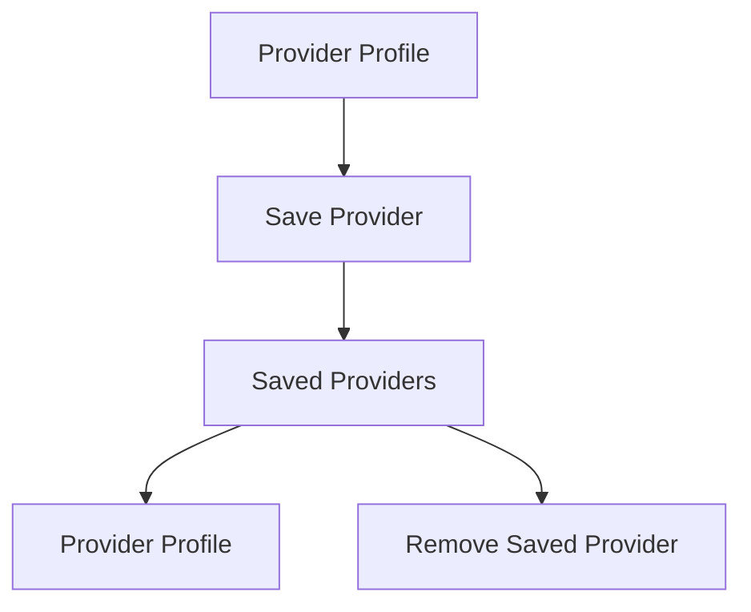

### Empty State

> **Your shortlist is empty.**

> Save providers you want to compare later.

---

# N.3 Provider Profile

## Entry

- Match Results
- Search
- Map
- Saved Providers
- Requests

## Actions

- View trust
- View reviews
- View recommendations
- Connect
- Save
- Return

---

# N.4 Provider Profile Editing

```text
Provider Dashboard
 ↓
Edit Profile
 ├── Basic Info
 ├── Skills
 ├── Services
 ├── Pricing
 ├── Availability
 ├── Service Area
 └── Trust / Verification
 ↓
Save
 ↓
Updated Profile
```

The provider profile requirements include skills, categories, experience, pricing, availability, service area, description, and contact preference. fileciteturn3file0L416-L430

---

# O. ERROR & EDGE CASE FLOWS

## O.1 No Matches

### Condition

No provider reaches the minimum matching threshold.

### Product Response

> **No strong matches found**

Recovery options:

- Increase radius
- Relax optional criteria
- Modify requirement

The system must not invent providers. fileciteturn4file4L1007-L1023

### Flow

```text
Results
 ↓
No Strong Matches
 ├── Increase Radius
 ├── Relax Optional Criteria
 └── Edit Requirement
```

---

# O.2 No Providers Nearby

### Condition

No relevant candidates exist within the current geographic radius.

### Product Response

> **No strong matches nearby.**

Actions:

- Expand search area
- Change location
- Post a Need
- Edit requirement

---

# O.3 Location Denied

```text
Request Location
 ↓
Permission Denied
 ↓
Choose Location Manually
 ↓
Search Address / Locality
 ↓
Approximate Coordinates
 ↓
Continue Discovery
```

The product must remain usable without GPS. fileciteturn4file0L23-L35

---

# O.4 Location Unavailable / Inaccurate

### Product Response

> **We couldn't get an accurate location.**

Actions:

- Choose locality
- Enter address
- Retry location

Do not block the complete product behind GPS.

---

# O.5 AI Failure

```text
AI Parse
 ↓
Failure
 ↓
Retry
 ↓
Deterministic extraction where possible
 ↓
Enough information?
 ├── Yes → Continue
 └── No → Ask Clarification
```

### User Copy

> **We couldn't fully understand your request.**

> Try adding the service, location, budget, or timing.

The fallback sequence is directly supported by the TRD. fileciteturn4file8L1737-L1749

---

# O.6 AI Ambiguity

Example:

> “Need a tutor nearby.”

Missing:

- Subject
- Education level
- Budget
- Schedule

### Product Response

Do not invent these values.

Ask:

> **What subject do you need help with?**

Then continue parsing.

The TRD explicitly prohibits inventing missing requirements. fileciteturn4file6L1400-L1418

---

# O.7 Invalid Budget

### Invalid

- Negative value
- Invalid currency
- Malformed number

### Product Response

> **Enter a valid budget.**

If budget is simply missing:

Continue without budget matching rather than inventing a value. fileciteturn4file8L1765-L1775

---

# O.8 Provider Offline

### Condition

Provider becomes unavailable after appearing in results.

### Flow

```text
Provider Results
 ↓
Provider Profile
 ↓
Connect
 ↓
Availability Recheck
 ↓
Unavailable
```

### Product Response

> **This provider is currently unavailable.**

Actions:

- Return to matches
- View alternatives

The provider should not normally rank as available when marked unavailable. fileciteturn4file8L1759-L1763

---

# O.9 Provider Request Rejected

```text
Request Sent
 ↓
Provider Declines
 ↓
Customer Status = Declined
 ↓
Offer Alternatives
```

### User Copy

> **This provider isn't available for your request.**

Actions:

**View Other Matches**

**Adjust Need**

---

# O.10 Network Failure

Network failure must not be confused with an empty result.

### No Results

> **No strong matches found.**

### Network Failure

> **Couldn't connect to Local Connect.**

Actions:

**Try Again**

The TRD explicitly requires these states to remain distinct. fileciteturn4file8L1783-L1797

---

# O.11 Request Creation Failure

```text
Connect
 ↓
Request Creation
 ↓
Failure
```

### Product Response

> **Your request wasn't sent.**

Actions:

- Try Again
- Return to Profile

Do not show backend/database errors.

---

# O.12 Incomplete Provider Profile

An incomplete provider may still appear if enough relevant information exists.

The product must:

- Never fabricate missing data
- Reflect missing information in trust
- Indicate missing information where relevant

This behavior is explicitly defined in the TRD. fileciteturn4file0L71-L78

---

# O.13 Empty Requests

### Customer

> **No requests yet.**

### Provider

> **No incoming requests yet.**

Actions:

- Customer → Find a Provider / Post a Need
- Provider → Improve Profile / Update Availability

---

# O.14 Offline PWA

When the network is unavailable:

```text
App Shell
 ↓
Offline State
 ↓
Cached safe public content where available
 ↓
Server-dependent actions disabled
```

The TRD requires an offline fallback and explicitly says full offline-first request creation is not required for MVP. fileciteturn4file0L1143-L1151

---

# P. COMPLETE SCREEN INVENTORY

| # | Screen | Purpose | Entry | Primary Next State |
|---:|---|---|---|---|
| 1 | Landing | Introduce product | App launch | Location / Auth / Home |
| 2 | Location Permission | Enable local discovery | Landing / Onboarding | Home |
| 3 | Manual Location | Location fallback | Permission denied | Home |
| 4 | Authentication | Establish identity | Protected action | Intended screen |
| 5 | Customer Onboarding | Basic setup | New account | Home |
| 6 | Provider Onboarding | Create provider profile | Provider role | Provider Setup |
| 7 | Home | Main customer entry | Auth / app launch | Need Input |
| 8 | AI Need Input | Capture natural-language need | Home | AI Parsing |
| 9 | AI Parsing | Understand requirement | Need Input | Confirmation |
| 10 | AI Clarification | Resolve ambiguity | Parsing | Parsing / Confirmation |
| 11 | Requirement Confirmation | Verify AI interpretation | Parsing | Matching |
| 12 | Requirement Editor | Modify requirements | Confirmation | Confirmation |
| 13 | Matching State | Find/rank providers | Confirmation | Results |
| 14 | Match Results | Compare providers | Matching | Provider Profile |
| 15 | Search | Manual discovery | Discover | Results |
| 16 | Categories | Browse service types | Discover | Results |
| 17 | Filters | Refine discovery | Search / Results | Results |
| 18 | Map | Geographic discovery | Discover / Results | Provider Preview |
| 19 | Provider Preview | Quick provider decision | Map | Profile |
| 20 | Provider Profile | Evaluate provider | Results/Search/Map | Connect |
| 21 | Trust Details | Understand trust | Provider Profile | Profile |
| 22 | Reviews | Review evidence | Provider Profile | Profile |
| 23 | Saved Providers | Manage shortlist | Profile | Provider Profile |
| 24 | Post a Need | Publish requirement | Home | Requirement |
| 25 | Post Need Review | Confirm requirement | Post Need | Publish |
| 26 | Published Need | Track posted requirement | Post Need | Responses |
| 27 | Provider Responses | Compare responses | Published Need | Profile/Connect |
| 28 | Connect Confirmation | Confirm request | Provider Profile | Request Status |
| 29 | Customer Requests | Track requests | Navigation | Request Detail |
| 30 | Customer Request Detail | View request | Requests | Status |
| 31 | Customer Profile | Manage account | Navigation | Settings/Saved |
| 32 | Provider Dashboard | Manage provider activity | Provider login | Requests |
| 33 | Provider Profile | Public provider identity | Dashboard | Edit |
| 34 | Provider Profile Edit | Update information | Provider Profile | Dashboard |
| 35 | Provider Skills | Manage skills | Onboarding/Edit | Next |
| 36 | Provider Pricing | Manage pricing | Onboarding/Edit | Next |
| 37 | Provider Availability | Manage availability | Onboarding/Edit | Next |
| 38 | Provider Service Area | Manage locality/radius | Onboarding/Edit | Next |
| 39 | Provider Trust Setup | Complete trust signals | Onboarding/Edit | Dashboard |
| 40 | Incoming Request | Review customer need | Provider Dashboard | Accept/Decline |
| 41 | Accepted Request | Active connection | Provider Request | Completed |
| 42 | Declined Request | Close request | Provider Request | Dashboard |
| 43 | Error State | Explain failure | Any async action | Recovery |
| 44 | Empty State | Explain no content | Any empty collection | Recovery |
| 45 | Offline State | Explain network state | Any screen | Retry |

---

# Q. END-TO-END CUSTOMER FLOW

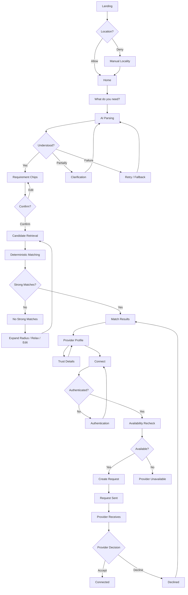

---

# R. END-TO-END PROVIDER FLOW

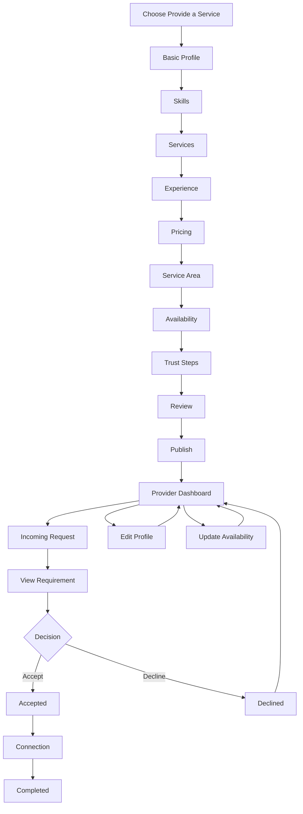

---

# S. DEMO FLOW

The PRD defines a 2–3 minute demo around natural-language input → AI extraction → nearby matches → Trust Score → community recommendations → provider profile → connection → provider receiving the request. fileciteturn4file1L415-L430

## Recommended Demo

### Step 1 — Need

User enters:

> “Mujhe 10th ke liye female maths teacher chahiye, weekend pe, ₹500 tak aur 4 km ke andar.”

### Step 2 — Understand

System extracts:

```text
Mathematics
Class 10
Female
Weekend
₹500
≤4 km
```

### Step 3 — Confirm

User confirms.

### Step 4 — Match

System returns:

> **94% Match — Priya**

### Step 5 — Explain

```text
✓ Mathematics match
✓ 1.2 km away
✓ Within budget
✓ Available weekends
✓ Strong local trust
```

### Step 6 — Trust

User opens Trust Score.

### Step 7 — Provider

User opens profile.

### Step 8 — Connect

User taps Connect.

### Step 9 — Provider

Provider receives request.

### Step 10 — Response

Provider accepts.

### Final State

> **Connected**

This is the shortest path that demonstrates the product's differentiated value.

---

# T. FLOW PRIORITY FOR HACKATHON

## P0 — Must Work

```text
Landing
 ↓
Location
 ↓
Auth
 ↓
Home
 ↓
Need Input
 ↓
AI Parsing
 ↓
Requirement Confirmation
 ↓
Matching
 ↓
Results
 ↓
Provider Profile
 ↓
Trust
 ↓
Connect
 ↓
Provider Request
 ↓
Accept
```

## P1 — Important

- Search
- Filters
- Post a Need
- Requests
- Provider onboarding
- Provider profile editing
- Saved providers
- Basic recommendations
- Map

## P2 — Later

- Advanced notifications
- Advanced analytics
- Complex social/community features
- Payments
- Complex scheduling
- Advanced fraud systems

The PRD explicitly keeps payments, complex KYC, advanced bidding, full social networking, complex analytics, and advanced fraud detection outside the MVP. fileciteturn3file0L385-L395

---

# U. FLOW RULES

## Rule 1 — Need Comes First

The user should not need to understand the platform's taxonomy before expressing a need.

## Rule 2 — AI Must Be Editable

AI interpretation is never final without user confirmation.

## Rule 3 — Match Must Be Explainable

Every important recommendation must be traceable to actual matching signals.

## Rule 4 — Trust Must Be Evidence

Trust Score is evidence aggregation, not a guarantee.

## Rule 5 — Location Is Helpful, Not Blocking

GPS denial must never kill the core product.

## Rule 6 — Provider Availability Must Be Real

Do not allow the UX to confidently present an unavailable provider.

## Rule 7 — No Fabrication

Never invent:

- Budget
- Location
- Skills
- Availability
- Trust
- Reviews
- Providers

## Rule 8 — Request Flow Must Stay Small

The MVP is not a full marketplace.

## Rule 9 — Errors Must Be Recoverable

Every failure should provide a meaningful next action.

## Rule 10 — The Core Loop Wins

If a feature does not strengthen:

> **NEED → MATCH → CONNECT**

it should not take priority over the core journey.

---

# V. FINAL FLOW SUMMARY

Local Connect should behave as one connected system rather than a collection of disconnected screens.

```text
USER
 ↓
NEED
 ↓
Natural-language requirement
 ↓
AI UNDERSTAND
 ↓
Structured + editable requirements
 ↓
MATCH
 ↓
Nearby candidate retrieval
 ↓
Deterministic ranking
 ↓
Explainable results
 ↓
TRUST
 ↓
Trust Score + verification + recommendations + reviews
 ↓
PROVIDER
 ↓
Profile + availability + pricing
 ↓
CONNECT
 ↓
Service Request
 ↓
PROVIDER RESPONSE
 ├── Accept → Connected
 └── Decline → Alternative Matches
```

The strongest version of the product is not the one with the most screens.

It is the one where a first-time user can move from:

> **“I need something.”**

to:

> **“I found the right person nearby, I understand why they match, and I can connect with them.”**

### **NEED → MATCH → CONNECT**

That is the primary flow every product decision should protect.
